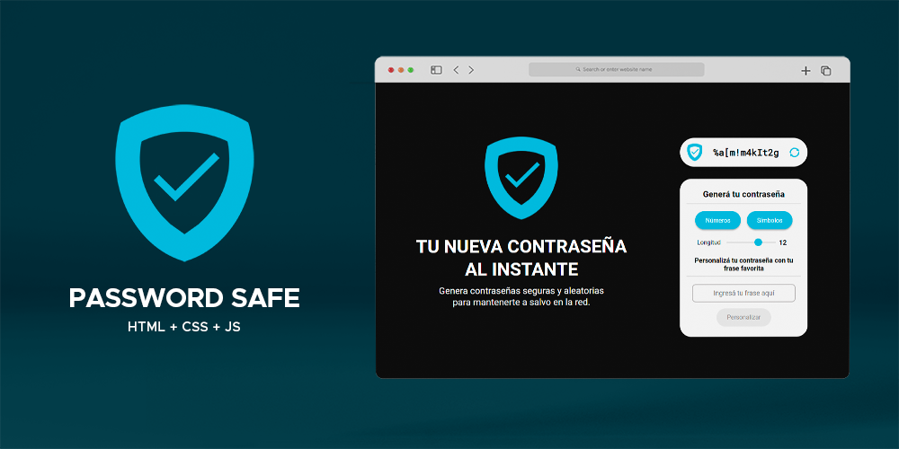

# Password Safe

### [Live Demo](https://juliangrosso.github.io/PasswordSafe/)

## Description

Generate secure and random passwords to keep you safe online.

## Stack

- HTML5
- CSS
- Vanilla JavaScript

## Features

- Generate secure and random passwords with random numbers and symbols.
- Adjust the character's length.
- Convert your favorite phrase into a secure password.
- Responsive. Mobile Ready.
